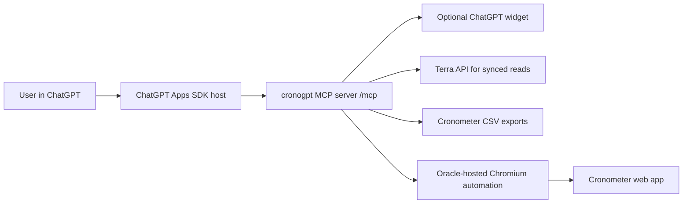

# Cronometer Control From ChatGPT

## Bottom line

There is a supported API path for reading Cronometer data, but it is not a normal first-party Cronometer user API. Terra advertises a Cronometer web API integration that can receive synced nutrition, workouts, and health metrics through webhooks and historical HTTP requests. Cronometer's official self-serve export path is CSV export from Account Settings.

For ChatGPT control, build an Apps SDK MCP server and expose tools. ChatGPT calls your server; your server talks to Terra, reads exported CSVs, or runs hosted browser automation on the Oracle-hosted Chromium worker. ChatGPT cannot directly reuse Codex's `@chrome` plugin.

## Architecture

On Oracle Always Free, the browser box runs local Chromium in the Playwright Docker image. A remote Chrome service such as Browserless remains an option if you want a separate persistent browser.

## Feature matrix

| Area | Feature | Best backend | Notes |
| --- | --- | --- | --- |
| Diary | Daily nutrition summary | Terra or CSV | Terra for current synced data; CSV for official export snapshots. |
| Diary | Food and recipe entries | Terra or CSV | Terra advertises user-input meals and nutrient breakdowns. |
| Diary | Exercises | Terra or CSV | Terra advertises workouts; CSV export can include exercises. |
| Diary | Biometrics | Terra or CSV | Cronometer CSV export can include biometrics. |
| Diary | Notes | CSV or browser | Official CSV export can include notes. |
| Logging | Log food | Browser fallback | No public Cronometer write API found. |
| Logging | Log exercise | Browser fallback | Could be browser-only unless partner API access is granted. |
| Logging | Log biometric | Browser fallback | Browser-only unless using an approved integration path. |
| Logging | Log note | Browser fallback | Browser-only. |
| Foods | Search verified food DB | Browser fallback | Cronometer food DB is not exposed as a public API. |
| Foods | Custom foods | Browser fallback | Use confirmation; data quality matters. |
| Foods | Custom meals | Browser fallback | Observed in the account under Foods > Custom Meals. |
| Foods | Recipes | Browser fallback | Recipe importer is a Gold feature; browser-only unless partner API exists. |
| Foods | Ask the Oracle | Browser fallback | Observed in the account under Foods > Ask the Oracle. |
| Foods | Suggest Food | Browser fallback | Submission flow should require confirmation. |
| Targets | Read/update targets | Browser fallback | Requires careful confirmation before writes. |
| Reports | Charts | Browser or CSV | Observed in the account under Trends > Charts. |
| Reports | Nutrition Report | Browser or CSV | Observed in the account under Trends > Nutrition Report. |
| Reports | Print Report | Browser fallback | Observed in the account under Trends > Print Report. |
| Reports | Snapshots | Browser fallback | Observed in the account under Trends > Snapshots. |
| Fasting | Start/stop fast | Browser fallback | Treat as write actions requiring user confirmation. |
| Scheduling | Repeat items/macro scheduler | Browser fallback | Gold feature; browser-only in this framework. |
| Settings | Targets + Profile | Browser fallback | Observed in the account under More > Targets + Profile. |
| Settings | Display Settings | Browser fallback | Read/write settings need confirmation for changes. |
| Integrations | Sync a Device | Browser fallback | Observed CONNECT actions. Device OAuth should remain user-driven. |
| Sharing | Sharing settings | Browser fallback | High-sensitivity because it controls access to health data. |
| Account | Export Data | CSV/browser | Observed under Your Account. This is the official self-serve export path. |
| Account | Bulk Delete / Delete Account | Manual only | Dangerous actions; keep disabled unless a separate recovery/review plan exists. |
| Pro | Client data and reports | Browser or partner access | Requires stronger auth, audit logging, and privacy review. |

## Apps SDK requirements

1. MCP server that defines tools and serves `/mcp`.
2. Optional UI resource registered with Apps SDK metadata.
3. Tool schemas with clear input/output shapes.
4. Tool annotations such as `readOnlyHint`, `destructiveHint`, and `idempotentHint`.
5. HTTPS endpoint for ChatGPT. Local development needs a tunnel.
6. OAuth 2.1 or equivalent auth layer before any real personal-data or write tool.
7. User confirmation for write actions, especially food logs, target changes, fasting, deletes, or bulk edits.

## Security decisions

- Do not send Cronometer email/password to ChatGPT or store them in widget metadata.
- Do not include credentials in `structuredContent`; the model can read that.
- Keep sensitive details in server-side storage only.
- Use `_meta` only for widget-only data, not secrets.
- Redact prompt text and health data from logs unless you intentionally need it.
- Keep every write tool idempotent where possible and return the created entry ID.

## Implementation path

1. Start with `CRONOMETER_BACKEND=mock` and verify the MCP server in MCP Inspector.
2. Add Terra credentials and implement/verify `get_daily_summary`, `list_food_entries`, `list_exercises`, and `list_biometrics`.
3. Add a CSV importer for official exported files if Terra is not enough.
4. Deploy on Oracle Always Free with local Chromium, or set `REMOTE_CHROME_WS_ENDPOINT` to a remote Chrome provider and verify browser-backed dry runs.
5. Implement browser-backed writes behind explicit confirmations and dry-run previews.
6. Add OAuth before connecting this to a real ChatGPT account beyond local testing.
7. Expose the server over HTTPS on Oracle, create the ChatGPT connector, refresh metadata, and test each tool.

## Future recipe workflow notes

- First priority is reliable food and custom-food adding: exact source-aware food selection, no stale search results, and full nutrient entry for custom foods.
- For the recipe workflow shown in Cronometer's diary context menu, prefer a browser tool that selects existing diary rows and uses `Create Recipe From Selected Items...` instead of rebuilding every ingredient row from search.
- Use a staging category/name such as `recipe creator` for temporary entries created only to assemble a recipe, then verify the final Custom Recipe exists before cleaning up temporary diary rows.
- Hosting is currently Oracle Always Free. The browser workflow still needs multi-minute, stateful Chromium sessions, so keep Browserless-style providers as a fallback only if Oracle reliability degrades.

## Useful public references

- Apps SDK quickstart: https://developers.openai.com/apps-sdk/quickstart
- Apps SDK MCP server build guide: https://developers.openai.com/apps-sdk/build/mcp-server
- Apps SDK connection guide: https://developers.openai.com/apps-sdk/deploy/connect-chatgpt
- Apps SDK security guide: https://developers.openai.com/apps-sdk/guides/security-privacy
- Cronometer account export support: https://support.cronometer.com/hc/en-us/articles/360018760151-Account-Settings
- Terra Cronometer integration: https://tryterra.co/integrations/cronometer
